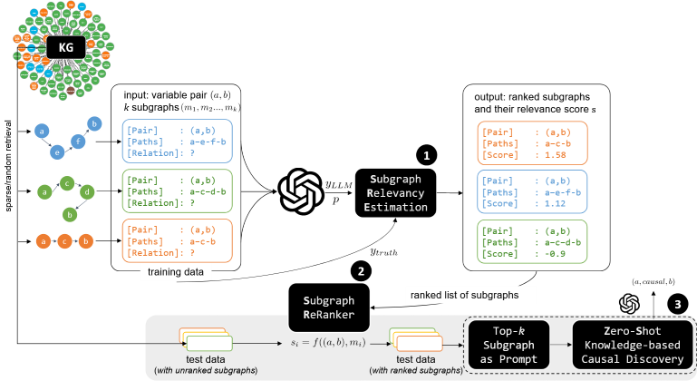

# Supplementary materials: 
## Causality Through Connections: Knowledge Graphs and Large Language Models for Enhanced Causal Inference

Including the preprocessed datasets, codes, [prompt](src/zero_templatizer.py), and subgraph ranking results from the subgraph rankers.
<!-- including the [datasets](datasets/), [codes](src/), and an [subgraph ranking results](checkpoints) from the subgraph re-rankers. -->

#### Requirements
```pip install -r requirements.txt```

#### Running main experiment
`bash run_kbcd.sh`

#### Running (Training) Subgraph Ranker
`bash run_ltr.sh`

(complete readme to-be-added)


